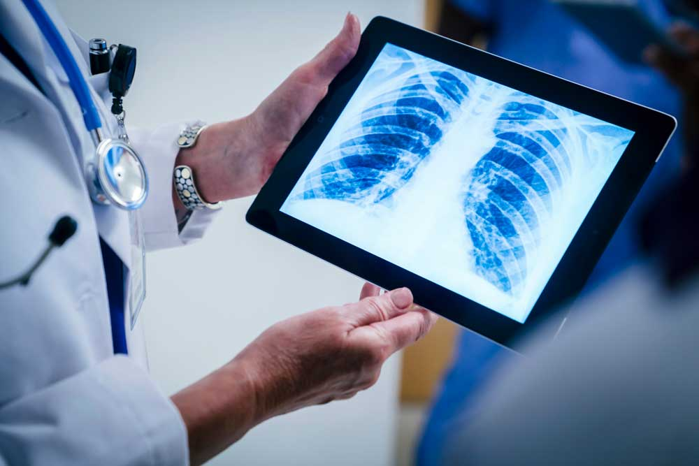
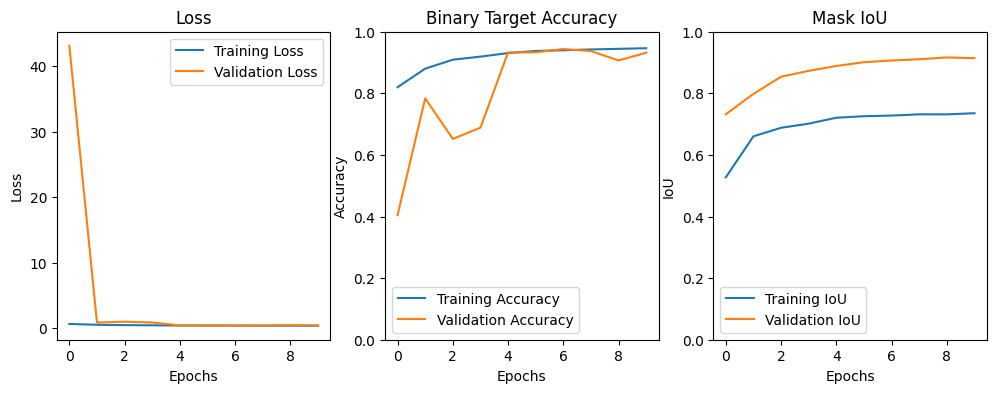
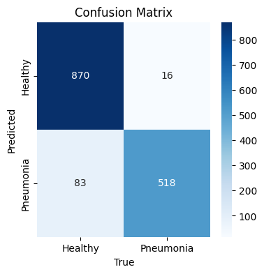
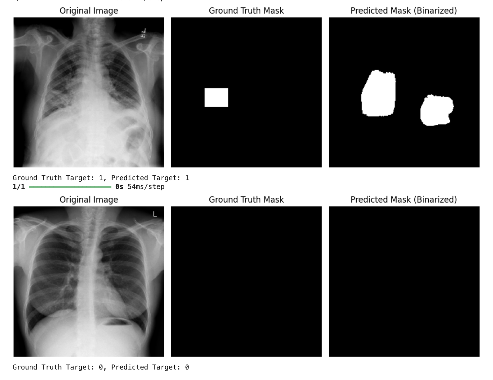
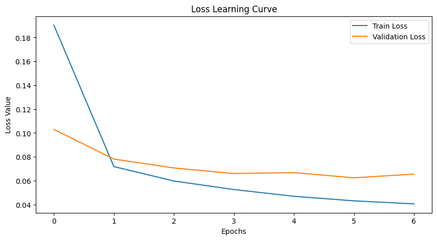
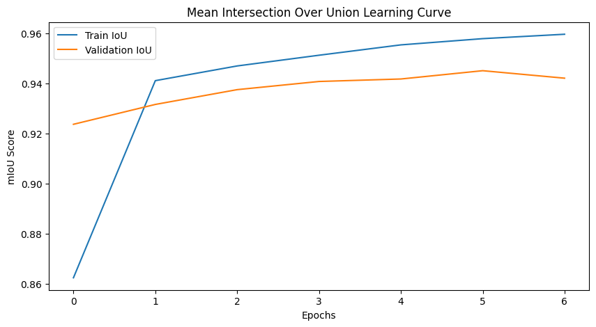
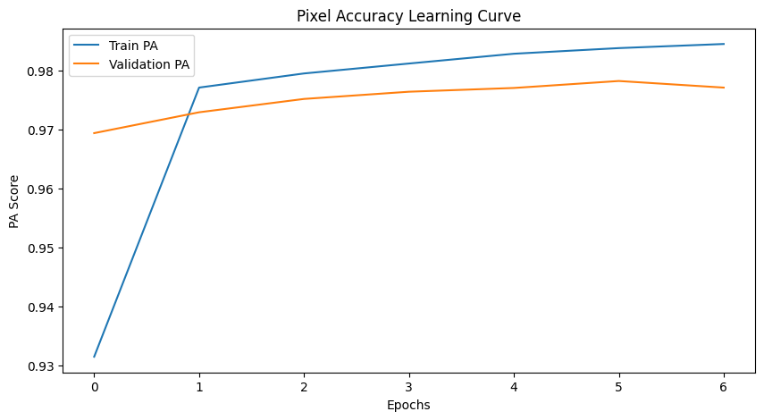
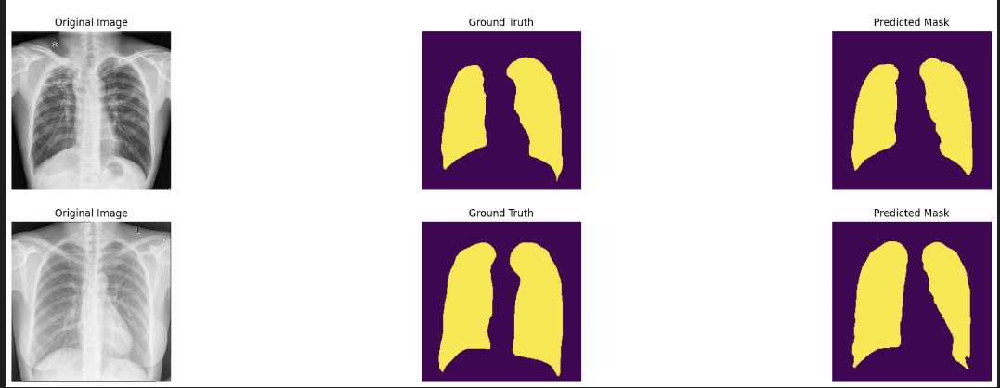
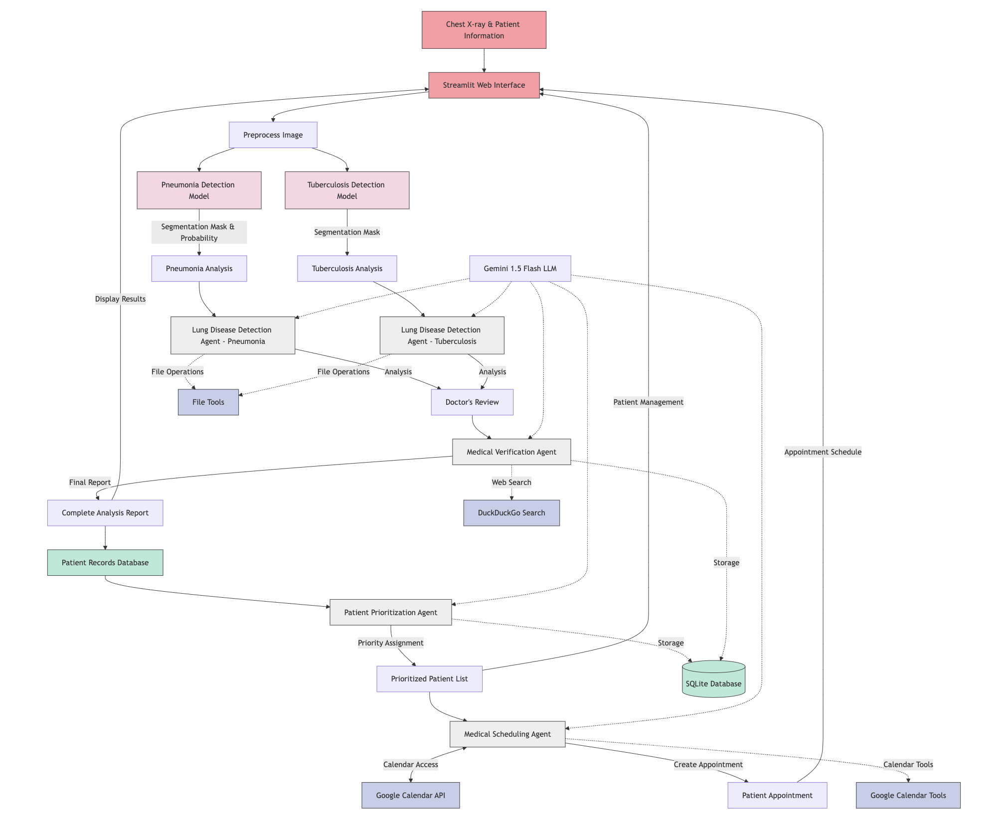

# AI-Powered Medical Diagnostic System for Radiologists


## Demo

### Video Demo
[Video](https://youtu.be/qVQM_3wlfvQ?feature=shared)


## Overview

This AI-powered diagnostic system aims to assist radiologists in high-volume healthcare settings by automating the analysis of chest X-rays. It addresses the critical shortage of radiologists, especially in countries like India, where the ratio stands at approximately 1 radiologist per 100,000 people. The system leverages advanced deep learning models for medical image segmentation and an AI-driven agentic system to streamline the diagnostic workflow.


## Project Highlights

- **U-Net model** for pneumonia segmentation
- **DeepLabV3 model** for tuberculosis segmentation
- **Six specialized AI agents** to automate the diagnostic workflow:
  - Disease Detection Agents (Pneumonia & Tuberculosis)
  - Doctor Verification Agent
  - Patient Prioritization Agent
  - Calendar Scheduling Agent
  - Patient Notification Agent
- **Streamlit-based web interface** for easy interaction
- **Integration with Google Calendar API** for automated appointment scheduling

## Problem Statement

Chest radiography is the most commonly used medical imaging modality worldwide for assessing thoracic conditions. However, accurately interpreting chest X-rays (CXR) remains a challenge due to:

- Shortage of trained radiologists in many regions
- Variability in interpretation among experts
- Workflow differences between institutions
- Rare conditions familiar only to subspecialists

These factors often lead to inconsistent diagnoses and delays in patient care. Our solution addresses these challenges by automating the CXR interpretation process.

## Technology Stack

- **PyTorch** - For medical image segmentation models
- **PhiData framework** - For AI Agents System
- **Gemini API** - Large Language Model
- **Google Calendars API** - For appointment scheduling
- **Streamlit** - For web interface
- **Python** - Core programming language

## Model Results

### U-Net Model for Pneumonia Segmentation

The U-Net architecture, originally developed for biomedical image segmentation, serves as the backbone of our pneumonia detection system. This encoder-decoder network with skip connections excels at preserving spatial information while capturing contextual details at different scales.

#### Training Performance



The training graphs show the model's learning progression over 9 epochs

#### Classification Metrics

```
              precision    recall  f1-score   support
     Healthy       0.91      0.98      0.95       886
   Pneumonia       0.97      0.86      0.91       601
    accuracy                           0.93      1487
   macro avg       0.94      0.92      0.93      1487
weighted avg       0.94      0.93      0.93      1487
```

The model achieves:
- 93% overall accuracy across 1,487 test images
- 95% F1-score for healthy lung classification
- 91% F1-score for pneumonia detection
- High precision (97%) for pneumonia cases, reducing false positives

#### Confusion Matrix




#### Segmentation Results



The image shows three examples of the U-Net's segmentation capabilities

Our U-Net implementation successfully segments pneumonia regions with high accuracy, providing radiologists with precise visualization of affected areas. The model demonstrated robust performance across various chest X-ray images, including those with different levels of disease severity and image quality variations.

### DeepLabV3 Model for Tuberculosis Segmentation

DeepLabV3 represents a state-of-the-art architecture for semantic image segmentation that leverages atrous (dilated) convolutions and spatial pyramid pooling to effectively capture multi-scale contextual information. Our implementation employs a ResNet-101 backbone pre-trained on ImageNet, which we fine-tuned specifically for tuberculosis detection in chest X-rays.

#### DeepLabV3 Loss Curve


The loss learning curve demonstrates the model's efficient convergence over 6 epochs:


#### DeepLabV3 IoU Curve



The Mean Intersection over Union (mIoU) learning curve showcases excellent segmentation performance:


#### Pixel-Level Accuracy



The pixel accuracy metrics further confirm the model's precision:


Our DeepLabV3 implementation achieves exceptional tuberculosis segmentation performance with several key advantages:
- **High IoU Score**: 0.94 on the validation set indicates precise localization of tuberculosis manifestations
- **Excellent Pixel Accuracy**: >97% accuracy in pixel-level classification demonstrates the model's reliability


#### Segmentation Results



## Workflow Diagrams


### Agent Interaction Flow



## Installation

### Prerequisites

- Python 3.8+

- Google Cloud account (for Gemini API and Calendar API)

### Environment Setup

1. Clone the repository:
```bash
git clone https://github.com/yourusername/ai-medical-diagnostic-system.git
cd ai-medical-diagnostic-system
```

2. Create a virtual environment:
```bash
python -m venv venv
source venv/bin/activate  # On Windows: venv\Scripts\activate
```

3. Install dependencies:
```bash
pip install -r requirements.txt
```

4. Download pre-trained models:
```bash
# Models are available in the models folder as Google Drive links
# Please download them and place in the appropriate directory
mkdir -p models/unet
mkdir -p models/deeplabv3
# Download models from the provided Drive links in the models folder
```

5. Set up API keys:
```bash
# Create a .env file with your API keys
touch .env
# Add the following lines to the .env file:
# GEMINI_API_KEY=your_gemini_api_key
# GOOGLE_CALENDAR_CREDENTIALS_PATH=path_to_your_credentials.json
```

## Dataset

The models were trained using publicly available datasets:

- [Kaggle Pneumonia Dataset](https://www.kaggle.com/datasets/paultimothymooney/chest-xray-pneumonia)
- [Kaggle Tuberculosis Dataset](https://www.kaggle.com/datasets/tawsifurrahman/tuberculosis-tb-chest-xray-dataset)

You can download these datasets from Kaggle and prepare them according to the instructions in the `data_preparation.md` file.

## Usage

1. Start the Streamlit web app:
```bash
streamlit run app.py
```

2. Upload a chest X-ray image through the web interface.

3. The system will:
   - Process the image using the segmentation models
   - Generate diagnostic insights using the AI agents
   - Create a prioritized case for patient scheduling
   - Schedule an appointment based on case severity
   - Notify the patient via email

## Project Structure

```
ai-medical-diagnostic-system/
├── app.py                      # Streamlit web application
├── pages/                     

│   ├── ai_agent.py             # AI agents implementation 
│   ├── pneumonia_detection.py  # Pneumonia Segmentaton Model
│   ├── tb_segemntation.py      # TB Segmentaton Model
├── saved_models/              
│   ├── unet.py               
│   └── deeplabv3.py            
├── training dataset/           # Dataset storage (not in repo)
├── notebooks/                  # Jupyter notebooks for model training
├── requirements.txt            # Project dependencies
└── README.md                   # This file
```

## Research Background

The solution is grounded in robust research showing that AI assistance can improve clinicians' performance in detecting and localizing lung lesions on chest radiographs ([Source](https://www.atsjournals.org/doi/full/10.1164/rccm.201806-1013OC)).

Additional relevant research:
- [Deep Learning for Chest Radiograph Diagnosis](https://pubs.rsna.org/doi/10.1148/radiol.2017171117)
- [AI in Radiology: Transforming Clinical Practice](https://www.nature.com/articles/s41551-018-0324-8)

## Future Work

- Extend the system to cover more chest-related diseases and disorders
- Expand to other organs for which medical imaging helps in identifying diseases
- Implement more advanced segmentation techniques like vision transformers
- Fine-tune LLMs specifically for radiology report generation
- Develop mobile applications for better accessibility


## Contributors

- [Akanksha Narula](https://github.com/AkankshaNarula)


## Acknowledgements

- [PhiData](https://phidata.com/) for their agentic AI framework
- [Google Cloud](https://cloud.google.com/) for API support

## License

This project is licensed under the MIT License - see the LICENSE file for details.
